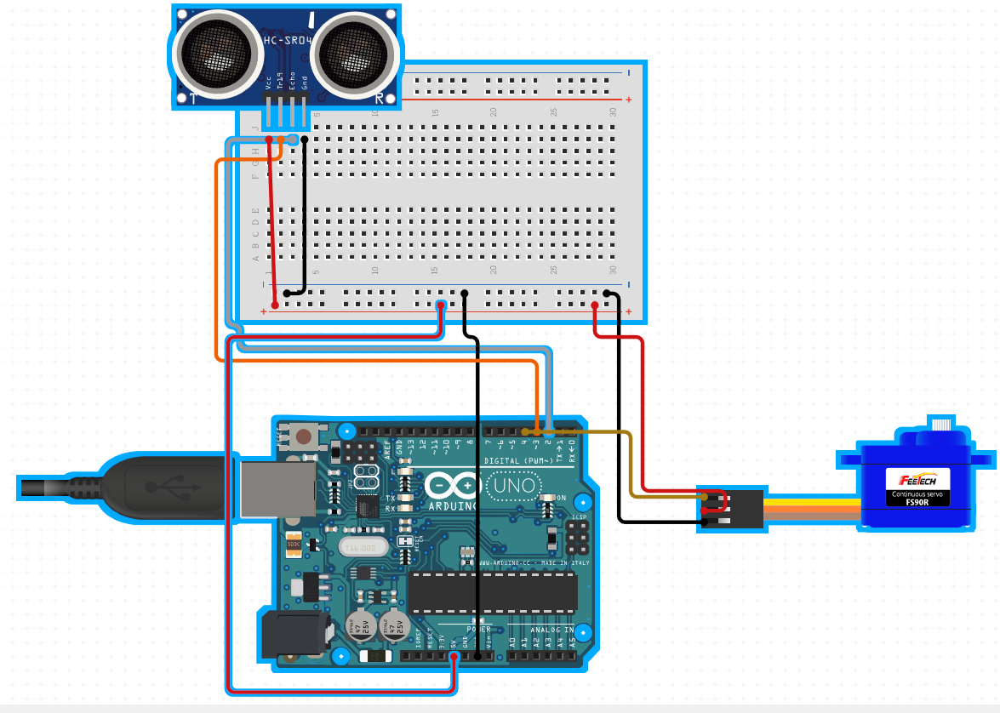

# Radar using ultrasonic sensor
Adding Ardiuno Project 
This Project Scope was to create a Radar which could sense objects between the range of 2 - 400cm
Used Ardiuno and Processing module to create the source code

<h1>Project components required:</h1>

1. Servo Motor (For rotation of the Sensor)
1. Ultrasonic Sensor (To Detect the object)
1. BreadBoard
1. Jumper Wires
1. Breadboard

<h1>IDE for compiling:</h1>
Ardiuno and Processing IDE

<h1>Circuit Protoype using circuit.io</h1>

